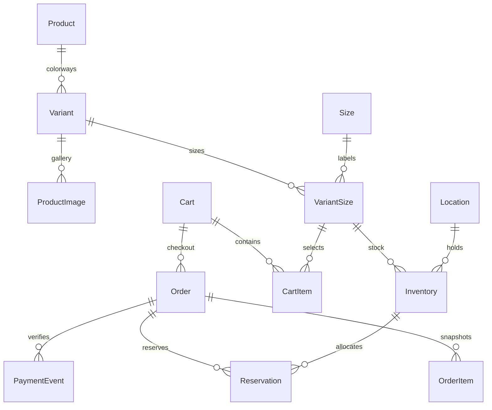

# Database

PostgreSQL is the transactional authority. The local helper uses PostgreSQL 17 on port 55432; Compose uses a persistent PostgreSQL 17 volume. The isolated SQLite opt-in cannot verify row locks and is not the supported commerce validation path.

| Area | Models |
| --- | --- |
| Catalogue | Brand, Category, Collection, Product, Variant, ProductImage, Size, VariantSize, Badge |
| Inventory | Location, Inventory, Reservation |
| Merchandising | SiteSettings, Announcement, Navigation, PageSection, Policy |
| Customers | Django User/Group/Permission, Profile, Address, Wishlist |
| Commerce | Cart, CartItem, Promotion, Order, OrderItem, OrderHistory, PaymentEvent, ReturnRequest |
| Engagement and operations | Review, Release, Subscription, RewardEntry, Outbox, AuditLog, AnalyticsEvent |

Database constraints cover unique slugs/SKUs, one default variant per product, one stock row per SKU/location, nonnegative stock with reservations bounded by physical stock, positive item quantities, unique cart/SKU pairs, cart-scoped checkout idempotency, review ownership and ledger deduplication. Currency amounts use decimal columns; API money is serialized as decimal text. Fresh order objects receive Decimal totals before provider amount conversion.

Checkout locks the cart, applicable promotions and inventory in a consistent order, reprices current records, checks exact size stock and snapshots order items. Reservation expiry releases stock and promotion usage. Payment verification locks the cart before the order and inventory, validates amount/currency/provider/session, consumes reservations and clears purchased quantities. PostgreSQL concurrency tests exercise final-unit contention, promotion expiry lock ordering and cart mutation during payment cleanup.

`0001_initial` creates the commerce schema. `0002_processed_media` adds originals/renditions and changes upload fields to validated processing fields. Upload processing also runs on model saves, not only Admin forms. Existing demonstration SVG filenames remain usable; new user SVG uploads are rejected.

Run `manage.py makemigrations --check --dry-run` before release and `manage.py migrate` through the one-off init service. Back up before applying migrations. No destructive reset is part of the startup workflow. See DEPLOYMENT.md for restore and rollback procedures.
