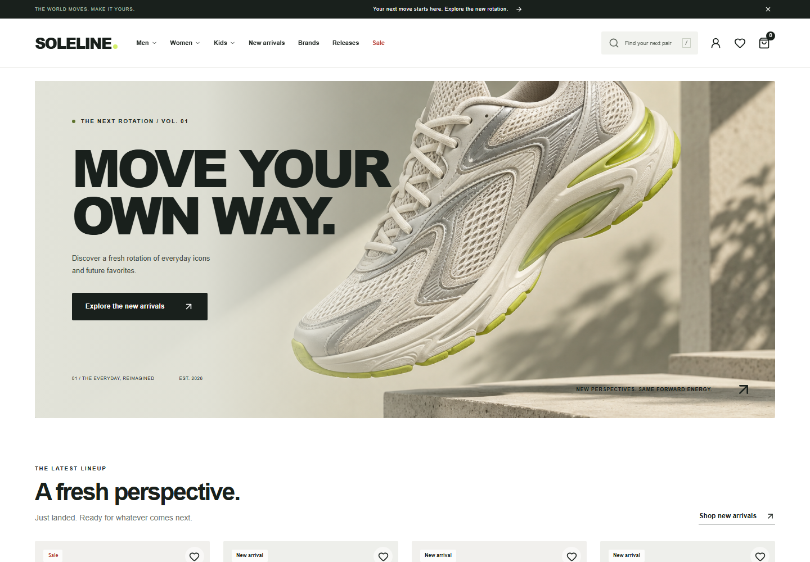
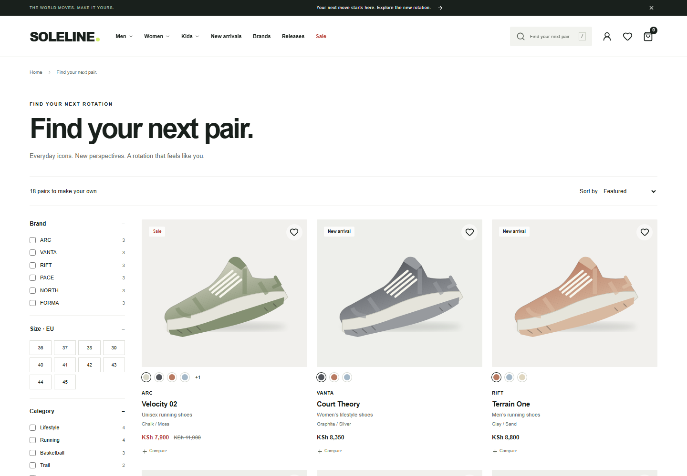
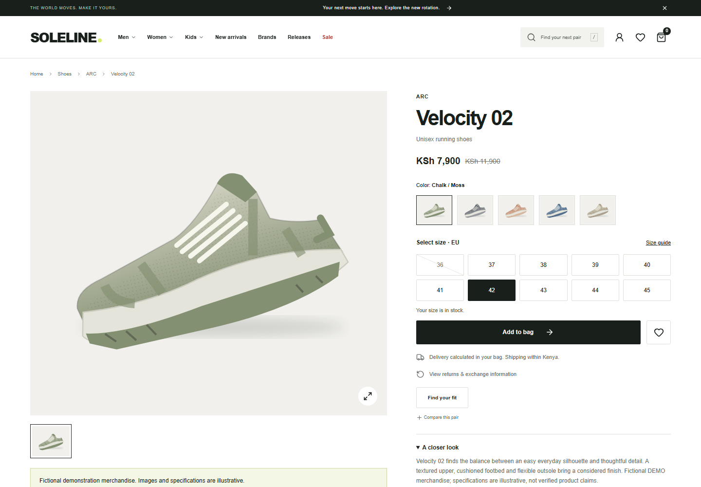
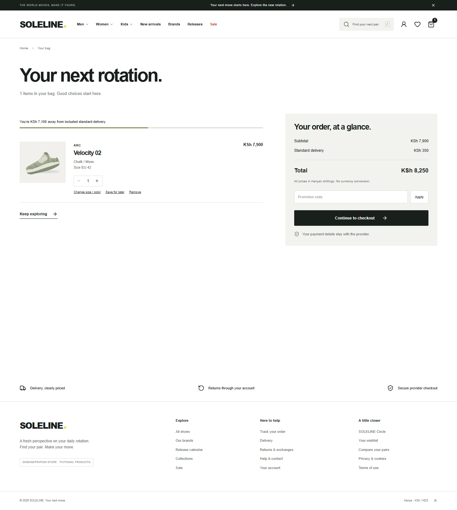
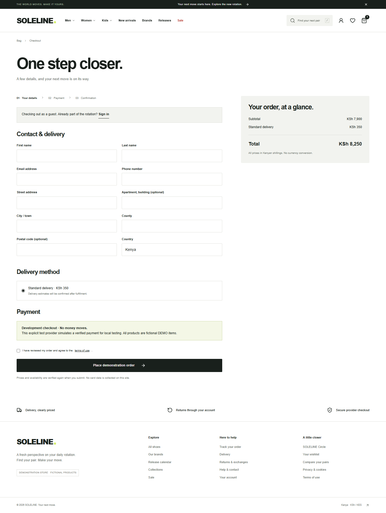
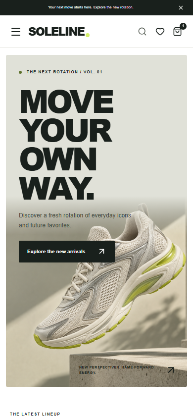

# SOLELINE screenshots

Captured from the locally running Next.js storefront and Django/PostgreSQL backend on September 13, 2026. Products and pricing are demonstration data. Desktop captures use a 1440 × 1000 viewport; mobile captures use a 390 × 844 viewport. Some images include the full page.

## Desktop storefront

[View the full homepage](home-desktop.png).

## Catalogue

## Product detail

## Shopping bag

## Demonstration checkout

The capture shows the checkout form before submission. No order or payment was submitted for these screenshots.

## Mobile storefront

[View the full mobile homepage](home-mobile.png).

## Earlier browser-test captures

The following images were captured during local browser testing on September 9, 2026:

- [Catalogue at 375 pixels](catalog-375.png)
- [Catalogue at 390 pixels](catalog-390.png)
- [Catalogue at 430 pixels](catalog-430.png)
- [Simulated order confirmation](order-confirmation.png)
